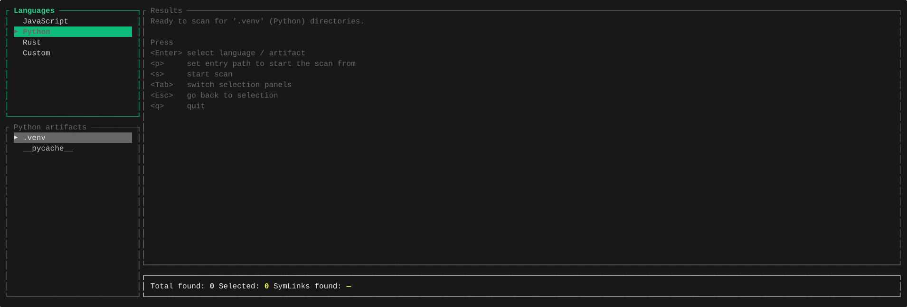

# Devtox

a minimal CLI tool to selectively remove unnecessary folders and show the stats.

to be used as a replacement of scripts

---

- clone the repository and run with `cargo run --features dev-tracing` to generate logs in `dev.log` file

- configuration (search path and custom directory info) is stored at `/home/user/.config/config.json`
